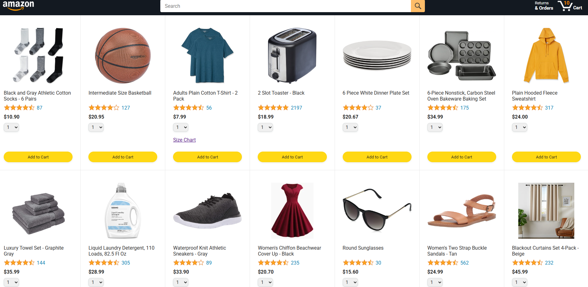
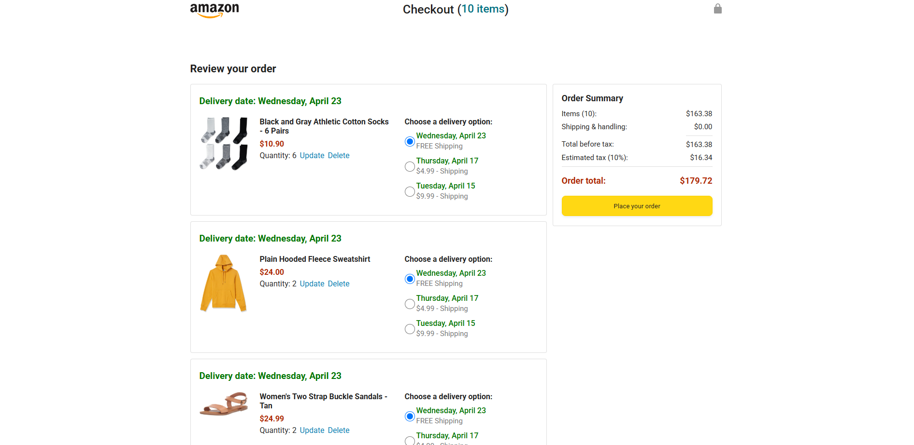
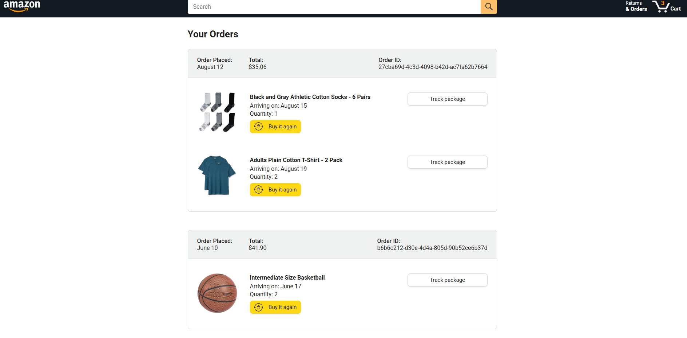
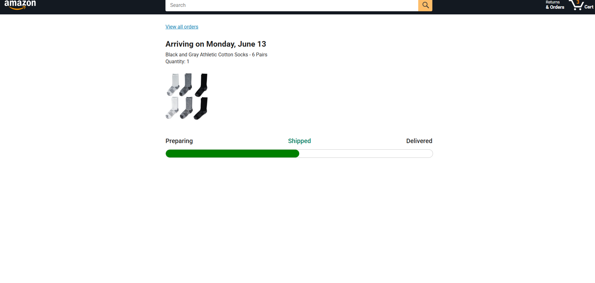

# 🛒 Amazon Clone (Frontend Prototype)

This project is a simple **frontend clone** of key pages from Amazon, created to explore and replicate the user experience of one of the most popular e-commerce platforms in the world.

It includes essential static pages that simulate the typical customer journey on an online shopping site.

## 📄 Included Pages

- **amazon.html** – Main homepage with product layout and search interface  
- **checkout.html** – Checkout page for reviewing cart and completing purchases  
- **order.html** – Order summary page displaying recent purchase details  
- **tracking.html** – Order tracking page showing shipment status  

## ⚙️ Technologies & Concepts

- **HTML5** and **CSS3** for structure and styling  
- **JavaScript** fundamentals for interactivity, including:
  - DOM manipulation  
  - Event handling  
  - Dynamic content rendering  
  - Basic form validation

These concepts were used to simulate dynamic behavior and improve user interaction within the static pages.

## 🎯 Purpose

This project was built to practice frontend development and UI design by recreating the layout and structure of Amazon's core pages. It reflects my growing understanding of web technologies and my focus on building intuitive, clean user interfaces.

## 🖼️ Screenshots

### 🏠 Amazon Homepage

---

### 🛒 Checkout Page

---

### 📦 Order Summary

---

### 🚚 Order Tracking

## 💡 Future Plans

- Add more interactivity using advanced JavaScript or frameworks like Vue.js  
- Connect to a backend (Laravel or Node.js) to make the site dynamic  
- Improve responsiveness across all devices  
- Add user authentication and cart persistence

---

Feel free to explore the code and contribute ideas or suggestions!
